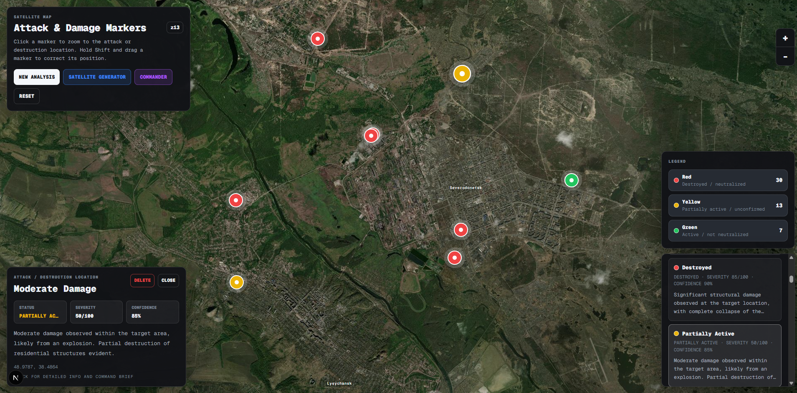
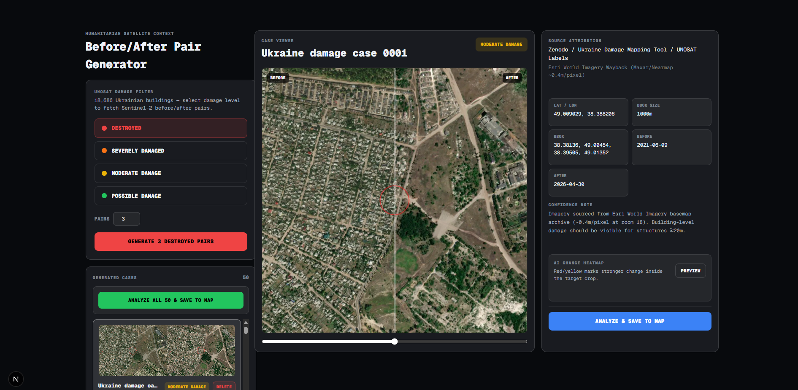
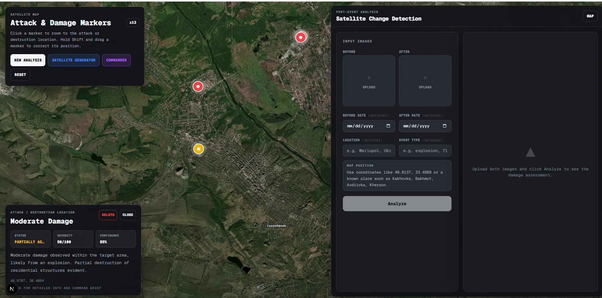
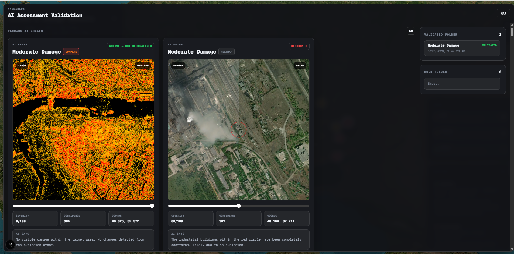
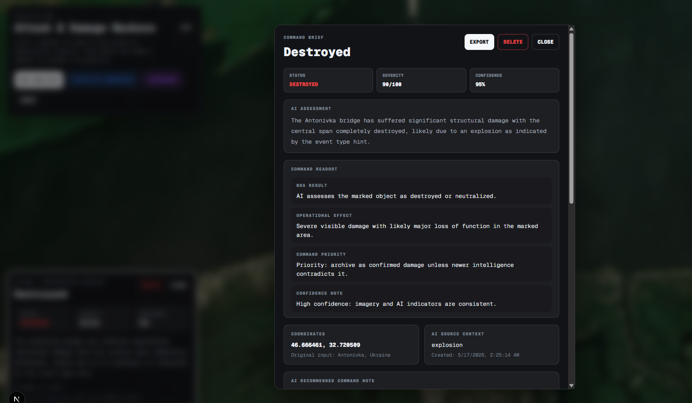
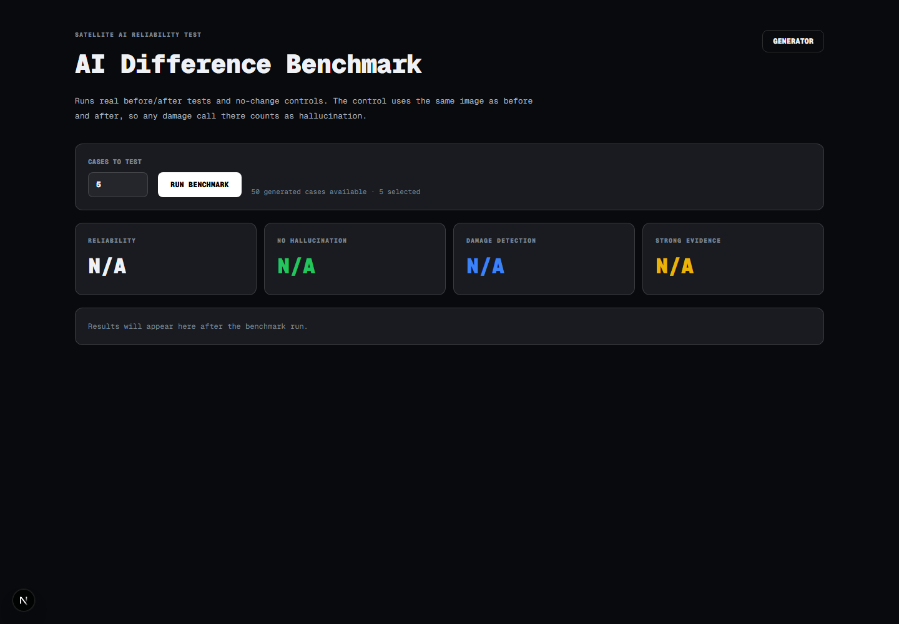

# After Map — AI Satellite Damage Assessment

> **Hackathon project** — AI-assisted before/after satellite imagery analysis for conflict zones. Built to be extended.

---

## What is this?

After a strike or attack, someone has to manually compare satellite images to figure out what actually got destroyed. That process is slow and doesn't scale.

**After Map automates the first step.**

It pulls real ESA Sentinel-2 satellite images from before and after a damage event, runs them through an AI model, and shows the result on a map — with a human review step built in. The operator validates or rejects each AI call before anything is finalized.

---

## Screenshots

### Main Map — Attack & Damage Markers


### Satellite Generator — Before/After Pair


### Satellite Change Detection — New Analysis


### Commander — AI Assessment Validation


### Marker Detail — AI Result on Map


### AI Reliability Benchmark


---

## How It Works

### 1. Data source
Uses the **UNOSAT dataset** (UN Satellite Centre) — 18,000+ verified building damage coordinates across Ukraine, with damage class labels (Destroyed, Severely Damaged, etc.).

### 2. Satellite imagery
For each coordinate, the system fetches two **ESA Sentinel-2 L2A** images:
- **Before** — from the pre-invasion window (Jun 2021 – Feb 2022)
- **After** — from the post-damage period (damage date → present)

Both acquisition dates are ESA-verified. Resolution: 10m/pixel, true-colour RGB.

### 3. AI analysis — 5 images per case

Before the AI sees anything, the browser computes a **pixel-level change heatmap** by comparing both images at 1024×1024. Then the AI receives:

| # | Image | Purpose |
|---|-------|---------|
| 1 | Before — full scene | Geographic context |
| 2 | After — full scene | Geographic context |
| 3 | Before — 42% centre crop | Target baseline (zoomed in on damage point) |
| 4 | After — 42% centre crop | Target post-event state |
| 5 | Change heatmap | Pixel diff guide — red = change, black = no change |

The AI focuses on the **red circle** in the centre — the exact GPS coordinate of the damage. It checks for collapsed roofs, burn marks, craters, missing shadows, debris. The heatmap guides attention, but the AI must confirm changes in the actual images before assigning damage.

### 4. Structured output

```json
{
  "target_status": "destroyed | partially_active | active | unknown",
  "confidence_score": 85,
  "damage_severity_score": 72,
  "affected_objects": [{ "name": "residential block", "damage_percent": 90 }],
  "user_visible": {
    "summary": "The building at the marked coordinate shows clear roof collapse..."
  }
}
```

### 5. Human review

Every AI result goes into the **Commander Review Panel**. The operator checks the images, reads the explanation, and validates / holds / rejects. The AI does the heavy lifting — the human makes the final call.

---

## Benchmark

Runs two tests per case:
- **Hallucination control** — same image as before and after. Any damage call = hallucination.
- **Real before/after** — verified Sentinel-2 pairs where damage is known.

| Metric | Result |
|--------|--------|
| Overall reliability | **94%** |
| No hallucination | **100%** |
| Damage detection | **88%** |
| Strong evidence (high confidence) | **80%** |

---

## Use Cases

**Strike / BDA (Battle Damage Assessment)**
After an offensive strike, verify whether the target was actually destroyed — without manual image comparison.

**Defensive monitoring**
Track whether critical infrastructure (bridges, power plants, roads) is still standing across a region.

**Humanitarian & NGO**
Rapid damage assessment at scale for relief prioritization, UNOSAT-style reporting, and post-conflict reconstruction planning.

**Research & training data**
The benchmark module generates labeled before/after pairs with AI verdicts — useful for building fine-tuned damage assessment models.

---

## Where This Can Go

This is version one. The pipeline is modular.

**Custom AI model** — Train a dedicated model on your own labeled dataset for a specific region, target type, or resolution. A fine-tuned model would be faster, cheaper, and more accurate than a general vision model.

**Drone footage** — The same 5-image pipeline works with drone imagery. Higher resolution, lower altitude, real-time capable. Just train the model on that image type.

**Custom datasets** — Replace the UNOSAT GeoJSON with any coordinate + damage label dataset. The generator accepts any GeoJSON FeatureCollection.

---

## Tech Stack

| Component | Technology |
|-----------|-----------|
| Framework | Next.js 16 (App Router), TypeScript |
| Satellite imagery | ESA Sentinel-2 L2A via [Sentinel Hub Process API](https://www.sentinel-hub.com) |
| Damage dataset | [UNOSAT Ukraine / Zenodo](https://zenodo.org/records/11385161) |
| AI model | OpenAI vision model via the Responses API |
| Map | Custom slippy map, Esri World Imagery basemap |
| Change detection | Client-side canvas pixel diff + Sobel edge strength heatmap |

---

## Getting Started

### 1. Clone & install

```bash
git clone https://github.com/martonalpha/after-map.git
cd after-map
npm install
```

### 2. Set up credentials

```bash
cp .env.example .env.local
```

Fill in `.env.local` with the credentials below. The file must be in the project root, next to `package.json`.

```env
OPENAI_API_KEY=your-openai-api-key-here
OPENAI_MODEL=gpt-4.1-mini

SENTINELHUB_CLIENT_ID=your-sentinel-hub-client-id
SENTINELHUB_CLIENT_SECRET=your-sentinel-hub-client-secret
SENTINELHUB_BASE_URL=https://services.sentinel-hub.com
```

Never commit `.env.local`. It is already ignored by Git.

### 3. Where to get API keys

#### OpenAI

Used for AI image analysis in `/api/review`.

1. Create or log in to an OpenAI Platform account: [https://platform.openai.com](https://platform.openai.com)
2. Open the API keys page: [https://platform.openai.com/api-keys](https://platform.openai.com/api-keys)
3. Click **Create new secret key**.
4. Copy the key into `.env.local` as:

```env
OPENAI_API_KEY=your-openai-api-key-here
```

Official guide: [Where do I find my OpenAI API key?](https://help.openai.com/en/articles/4936850-where-do-i-find-my-openai-api-key)

Optional model setting:

```env
OPENAI_MODEL=gpt-4.1-mini
```

Leave `OPENAI_MODEL` unchanged for the default setup.

#### Sentinel Hub

Used for satellite image generation in `/api/satellite/generate`.

1. Create or log in to Sentinel Hub: [https://apps.sentinel-hub.com/dashboard/](https://apps.sentinel-hub.com/dashboard/)
2. Open **User Settings** in the dashboard.
3. Find **OAuth clients**.
4. Create a new OAuth client.
5. Copy the **Client ID** and **Client Secret** into `.env.local`:

```env
SENTINELHUB_CLIENT_ID=your-client-id
SENTINELHUB_CLIENT_SECRET=your-client-secret
SENTINELHUB_BASE_URL=https://services.sentinel-hub.com
```

Official auth docs: [Sentinel Hub authentication](https://docs.sentinel-hub.com/api/latest/api/overview/authentication/)

### 4. Run

```bash
npm run dev
```

Open [http://localhost:3000](http://localhost:3000)

### 5. Deploying

If you deploy to Vercel or another host, add the same environment variables in the host's project settings:

```env
OPENAI_API_KEY
OPENAI_MODEL
SENTINELHUB_CLIENT_ID
SENTINELHUB_CLIENT_SECRET
SENTINELHUB_BASE_URL
```

For Vercel: open your project → **Settings** → **Environment Variables**.

---

## Pages

| Route | What it does |
|-------|-------------|
| `/` | Main map — damage markers, AI results, commander panel |
| `/satellite-generator` | Generate Sentinel-2 before/after pairs and run AI analysis |
| `/satellite-benchmark` | Reliability test — hallucination control + real change detection |

---

## License

MIT — open for research, humanitarian, and defensive use.

**Data:** [UNOSAT / UNITAR](https://www.unitar.org/maps/unosat) · [ESA Copernicus / Sentinel-2](https://sentinel.esa.int/web/sentinel/missions/sentinel-2)
